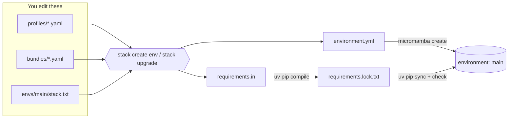

# uv-stack

Reproducible Python environments from small, reusable parts — powered by
[micromamba](https://mamba.readthedocs.io/en/latest/user_guide/micromamba.html)
and [uv](https://docs.astral.sh/uv/).

You describe what you want in a few small files — *profiles* (named package
groups), *bundles* (groups of profiles), and one `stack.txt` per environment.
The `stack` command renders, locks, and installs everything else, splitting the
work between two tools:

| Tool | Owns |
| --- | --- |
| `micromamba` | The Python interpreter and conda-level binary packages (from `conda-forge`) |
| `uv` | Every pip-level package — compiled to a lock file, then synced exactly |

Why you might want this:

- **Define packages once, reuse everywhere.** The same profile feeds your
  global notebook environment and your one-off project scaffolds.
- **Environments are rebuildable.** An environment is a pure function of its
  source files. Delete it, `stack create env NAME`, and it comes back.
- **Real locks.** Every environment gets a fully pinned
  `requirements.lock.txt`, compiled and installed with `uv` (fast), and
  verified with `uv pip check`.

---

- [Installation](#installation)
- [Quickstart](#quickstart)
- [How it works](#how-it-works)
- [Core concepts](#core-concepts)
- [Everyday commands](#everyday-commands)
- [Creating projects](#creating-projects)
- [Configuration reference](#configuration-reference)
- [Tips and gotchas](#tips-and-gotchas)

## Installation

Prerequisites (both must be installed and reachable):

- [`uv`](https://docs.astral.sh/uv/getting-started/installation/)
- [`micromamba`](https://mamba.readthedocs.io/en/latest/installation/micromamba-installation.html) —
  run `micromamba shell init` after installing so `$MAMBA_EXE` is set

Then install the CLI as a standalone tool (requires Python 3.12+):

```bash
uv tool install uv-stack
```

(`pip install uv-stack` works too.) This gives you one command: `stack`.

## Quickstart

Five minutes from nothing to a working, locked environment.

```bash
# One guided command sets up everything (config tree, starter profile,
# first environment) with prompts — or --yes to accept the defaults:
stack init

# Prefer explicit steps? The same result by hand:
stack config init
stack create profile ds numpy pandas --description "Core data-science stack" --tag data
stack create env main ds --python 3.12

# Use it (stack prints this hint after every successful create env):
micromamba activate main
# ...or run things in it without activating:
micromamba run -n main python
```

What just happened: `stack` resolved the `ds` token to your profile, generated
`requirements.in` and `environment.yml` inside `envs/main/`, had `micromamba`
create the `main` environment (Python 3.12 by default), compiled a pinned
`requirements.lock.txt` with `uv pip compile`, installed it exactly with
`uv pip sync`, and verified consistency with `uv pip check`.

From now on, changing what's installed is always the same two steps: edit a
source file (a profile, a bundle, or stack.txt), then run stack upgrade main.
Check what needs rebuilding at any time with stack status.

## How it works



`micromamba` builds the room (the interpreter and any conda-level binaries);
`uv` furnishes it (fast, fully locked pip packages). You only ever edit the
files on the left — everything on the right is generated and carries a
`# Generated by uv-stack — do not edit.` header.

## Core concepts

### Profiles

A profile is a named list of pip packages, stored as
`profiles/<name>.yaml` in the config root:

```yaml
description: Core data-science stack   # optional
tags: [data, core]                     # optional, used by `stack list --tag`
includes:                              # required: literal pip requirements
  - numpy>=2
  - pandas
```

### Bundles

A bundle is a recipe that composes profiles, other bundles, and literal
packages, stored as `bundles/<name>.yaml`. Same schema, but `includes` entries
are *stack tokens*:

```yaml
description: Everything for daily work
includes:
  - ds          # a profile
  - chem        # another profile
  - utils
```

Bundles can nest other bundles; duplicates are removed automatically.

### Stack tokens

Tokens are how you reference things in `stack.txt`, bundle `includes`, and on
the `stack create project` / `stack resolve` command line:

| Token | Meaning |
| --- | --- |
| `ds` (bare name) | Profile `ds` if it exists, else bundle `ds`, else a literal package |
| `profile:ds` | Profile `ds` (error if missing) |
| `@standard` or `bundle:standard` | Bundle `standard` (error if missing) |
| `pkg:numpy` or `package:numpy` | Always a literal package — the escape hatch when a name collides with a profile or bundle |
| `numpy>=2`, `-e ~/src/mytool`, archive paths | Literal pip requirement, passed through |

Use `stack resolve` to see how tokens are classified, and
`stack resolve --full` to expand them into a flat package list.

### Environments

A named environment lives in `envs/<name>/` under the config root. It exists
as soon as `stack.txt` does.

Files **you** write:

| File | Purpose |
| --- | --- |
| `stack.txt` | **Required.** One stack token per line; `#` comments allowed |
| `python.txt` | Interpreter version (defaults to `3.12`) |
| `micromamba.txt` | Extra conda packages (e.g. `graphviz`) |
| `channels.txt` | Extra conda channels (`conda-forge` is always first) |
| `requirements.local.in` | Machine-local pip additions, kept out of profiles |

Files `stack` generates (never edit these):

| File | Purpose |
| --- | --- |
| `environment.yml` | micromamba spec: `python=<version>`, `pip`, conda packages |
| `requirements.in` | Expanded, unpinned pip requirements |
| `requirements.lock.txt` | Fully pinned lock, produced by `uv pip compile` |

## Everyday commands

| Command | What it does |
| --- | --- |
| `stack init` | Guided first-run setup (config tree, starter profile, first env) |
| `stack create env NAME [TOKENS]...` | Scaffold (optional) and build an environment (`--recreate` wipes it first) |
| `stack create profile NAME PKG...` | Write a new profile YAML (`--description`, `--tag`) |
| `stack create bundle NAME TOKEN...` | Write a new bundle YAML (`--description`, `--tag`) |
| `stack upgrade [NAMES]...` | Re-render, re-lock, and sync environments |
| `stack status [NAMES]...` | Per-env build state: drift, lock freshness, existence |
| `stack list env\|profile\|bundle` | Tables of what exists (`--tag` filters, `--json` for scripts) |
| `stack show env\|profile\|bundle [NAME]` | Details for one item (`NAME` defaults to `main` for envs) |
| `stack resolve [--full] TOKENS...` | Classify tokens, or expand them to a flat package list |
| `stack doctor [--fix]` | Detect problems; `--fix` applies the safe repairs |
| `stack completion bash\|zsh\|fish` | Print the shell-completion script |
| `stack config init` | Create missing config directories (bare primitive) |

### Upgrading

```bash
stack upgrade main                      # one environment
stack upgrade main scratch              # several
stack upgrade                           # every environment (lists them, asks first)
stack upgrade --all -y                  # every environment, no prompt
stack upgrade --no-upgrade main         # re-lock without floating pins upward
stack upgrade --upgrade-package numpy main   # upgrade only numpy
stack upgrade --dry-run main            # print the command plan
```

By default `upgrade` recompiles the lock with `--upgrade` (everything floats
to the newest allowed versions), then syncs the environment to match the lock
exactly — packages you removed from a profile are uninstalled. A batch keeps
going past a failing environment and ends with a `✓`/`✗` summary
(`--stop-on-error` aborts at the first failure).

### Inspecting

```bash
$ stack resolve standard ds numpy
bundle:standard
profile:ds
package:numpy

$ stack resolve --full standard
numpy
pandas
rdkit
rich

$ stack list profile --tag data       # only profiles tagged 'data'
$ stack show env main                 # python, tokens, channels, resolved packages
```

### Checking your setup

```bash
stack doctor
```

`doctor` never changes anything — it reports problems (missing directories,
legacy file formats, environments in the wrong place) with a suggested `fix:`
line for each.

### Watching for drift

```bash
stack status
```

Shows one row per environment: whether the micromamba env exists, whether a
lock is present, and whether your sources changed since the last build
(`sources changed` means "run `stack upgrade`"). `--json` makes every
inspection command (`list`, `show`, `resolve`, `status`, `doctor`)
script-friendly.

### Typo protection

A bare token that matches no profile or bundle becomes a literal PyPI
package. If it looks like a near-miss of one of your names, `stack` warns
(`did you mean 'standard'?`). Add `--strict` to `upgrade`, `create env`,
`create project`, `create bundle`, or `resolve` to turn any unqualified
fallthrough into an error, and use the `pkg:` prefix to say "yes, really a
package."

### Shell completion

```bash
# zsh — add to ~/.zshrc:
eval "$(stack completion zsh)"
```

Tab-completes commands, options, and your environment/profile/bundle names.

## Creating projects

For per-project work, `stack` can seed a standard `uv` project from the same
profiles and bundles:

```bash
mkdir myproject && cd myproject
stack create project @standard pkg:httpx
```

This resolves the tokens to a flat package list, then runs `uv init --bare`,
`uv add`, and `uv sync` — leaving you a normal `uv` project with a
`pyproject.toml`, `uv.lock`, and `.venv/`.

Choosing the project's interpreter with `--python`:

- A version (`3.12`), a path, or a spec like `cpython@3.12` is passed straight
  to `uv`.
- **Anything else is treated as a micromamba environment name** — the project
  uses that environment's interpreter. `stack create project ds --python main`
  builds the project on `main`'s Python.
- With no `--python`, the default comes from `$UV_STACK_PROJECT_PYTHON`, then
  `<config-root>/project-python.txt`, then `3.12`.

Projects are a **one-shot handoff**: the stack tokens are not recorded in the
project. After creation, manage it with `uv` directly (`uv add`, `uv sync`,
`uv run`). `stack upgrade` applies only to named environments.

## Configuration reference

### Config root

All state lives under one directory, resolved in this order:

1. `--root PATH` (global flag)
2. `$UV_ENV_ROOT`
3. `~/.config/python-envs` (default)

```text
~/.config/python-envs/
├── project-python.txt        # optional: default --python for `create project`
├── profiles/
│   └── <name>.yaml
├── bundles/
│   └── <name>.yaml
└── envs/
    └── <name>/
        ├── stack.txt             # required (defines the env)
        ├── python.txt            # optional
        ├── micromamba.txt        # optional
        ├── channels.txt          # optional
        ├── requirements.local.in # optional
        ├── requirements.in       # generated
        ├── environment.yml       # generated
        └── requirements.lock.txt # generated
```

### Environment variables

| Variable | Purpose |
| --- | --- |
| `UV_ENV_ROOT` | Config root (overridden by `--root`) |
| `UV_STACK_PROJECT_PYTHON` | Default interpreter spec for `stack create project` |
| `MAMBA_EXE` | Path to the micromamba binary; set by `micromamba shell init` and preferred over `PATH` lookup |

## Tips and gotchas

- **Edit sources, not generated files.** `requirements.in`,
  `environment.yml`, and `requirements.lock.txt` are overwritten on every
  upgrade. For env-specific additions use `requirements.local.in`; for
  anything reusable, a profile.
- **`--dry-run` is almost dry.** It runs no commands and never touches the
  lock or the environment, but it does re-render `requirements.in` and
  `environment.yml`.
- **Your lock is safe from failed compiles.** The lock is compiled to a
  temporary file and atomically swapped in, so a failed `uv pip compile`
  never corrupts an existing `requirements.lock.txt`. If the later *sync*
  step fails (e.g. a network blip), just run `stack upgrade NAME` again.
- **Activation is micromamba's job.** `stack` builds environments; you enter
  them with `micromamba activate <name>` or run one-offs with
  `micromamba run -n <name> <command>`.
- **Name collisions.** A bare token prefers a profile over a bundle over a
  literal package. When a package name collides with one of your profile or
  bundle names, force the package with `pkg:<name>`.
- **`doctor --fix` is conservative.** It only applies safe repairs (creating
  missing directories, renaming legacy files, converting `.in`/`.bundle`
  files to YAML with a `.bak` backup). Anything destructive stays a printed
  suggestion.
- **Migrating old configs.** If you previously used `.in` profiles,
  `.bundle` files, or a `profiles.txt`, `stack doctor` will point at each
  leftover and tell you what to rename or convert.
